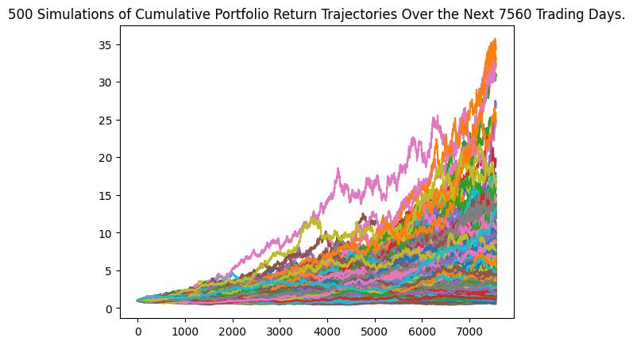
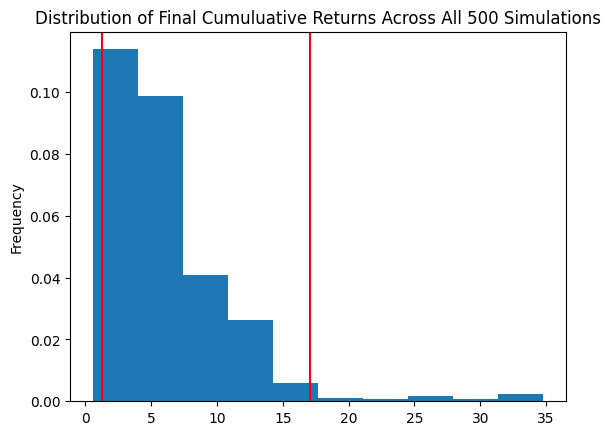

# Financial Planning

In this case study, I helped a hypothetical credit union to create a tool that helps their members enhance their financial health. 

The credit union board wants to allow the union's members to assess their monthly personal finances, and also be able to forecast a reasonably good retirement plan based on cryptocurrencies, stocks, and bonds.

In this project, I focused on using APIs as part of the technical solution to create two financial analysis tools.

## 1. Personal Finance Planner

The first tool is a personal finance planner that allows users to visualize their savings composed by investments in shares and cryptocurrencies to assess if they have enough money as an emergency fund. I used the following two crypto API URLs to retrieve BTC and ETH prices:
* https://api.alternative.me/v2/ticker/Bitcoin/?convert=USD
* https://api.alternative.me/v2/ticker/Ethereum/?convert=USD

using the `requests.get(url).json()` function. 

## 2. Retirement Planning

The second tool is a retirement planning tool that will use the Alpaca API to fetch historical closing prices for a retirement portfolio composed of stocks and bonds, then run Monte Carlo simulations to project the portfolio performance at 30 years. I also used the Monte Carlo data to calculate the expected portfolio returns given a specific initial investment amount. For example, for an initial investment of $20000 in the portfolio that contains 40% `AGG` and 60% `SPY`, we can run a Monte Carlo simulation to forecast 30 years cumulative returns. With 500 simulations, this figure shows the cumulative portfolio return trajectories over the next 30 years:

This figure shows the distribution of final cumulative returns:

There is a 95% chance that an initial investment of $20000 in the portfolio over the next 30 years will end within in the range of $26078 and $393262.

The results are summarized in this [notebook](financial-planner.ipynb).